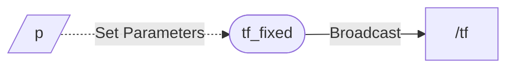

# tf_fixed

ROS node that continuously outputs /tf at regular intervals. Parameters allow configuration changes at any time.



## Install

```bash
cd (your ros2 workspace)/src
git clone https://github.com/shikishima-TasakiLab/tf_fixed.git
cd ..
colcon build
source ./install/setup/bash
```
