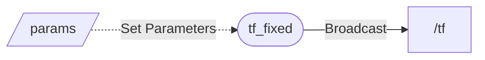

# [tf_fixed](https://github.com/shikishima-TasakiLab/tf_fixed)

ROS node that continuously outputs /tf at regular intervals. Parameters allow configuration changes at any time.



## Install

```bash
cd (your ros2 workspace)/src
git clone https://github.com/shikishima-TasakiLab/tf_fixed.git
cd ..
colcon build
source ./install/setup/bash
```

## Run

```bash
ros2 run tf_fixed tf_fixed
```

```bash
ros2 launch tf_fixed tf_fixed.launch.py
```

## Parameters

```yaml
tf_fixed:
  ros__parameters:
    period_ms: 1000

    frame_id: world
    child_frame_id: child_frame_id

    translation:
      x: 1.0
      y: 2.0
      z: 3.0
    
    use_quaternion: false       # Quaternions,
    use_euler_rad: false        # Euler angles (radians/degrees)
    use_euler_degrees: true     # selectable

    rotation:
      quaternion:
        x: 0.0
        y: 0.0
        z: 0.0
        w: 1.0
      euler_rad:
        roll: 0.0
        pitch: 0.0
        yaw: 0.0
      euler_degrees:
        roll: 45.0
        pitch: 30.0
        yaw: 60.0
```